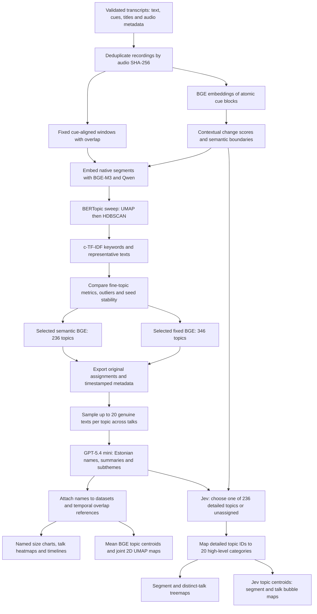

# Arvamusfestival transcript archive

This project builds a durable JSON transcript archive for the 2026 Arvamusfestival
podcast season. It resolves the podcast collection through the [Apple Podcasts
lookup API](https://itunes.apple.com/lookup) (collection ID `1477431807`) and then
uses the authoritative SoundCloud RSS feed returned by Apple. The RSS enclosure is
the audio source; its publication date determines the archive year.

## Prerequisites

Use Windows PowerShell with [uv](https://docs.astral.sh/uv/) installed and on
`PATH`. Install `ffmpeg` and make it available on `PATH`, because the external
Estonian audio-transcription skill processes MP3 audio. Configure the local skill
script path exactly as shown below, or replace it with the matching path on your
machine.

```powershell
uv sync --dev
uv run arvamusfestivali-transcripts run --year 2026 --dry-run --transcriber-script C:\Users\risto\projects\skils_plugins\plugins\estonian-audio-transcription\skills\estonian-audio-transcription\scripts\transcribe.py
uv run arvamusfestivali-transcripts run --year 2026 --limit 1 --transcriber-script C:\Users\risto\projects\skils_plugins\plugins\estonian-audio-transcription\skills\estonian-audio-transcription\scripts\transcribe.py
uv run arvamusfestivali-transcripts run --year 2026 --transcriber-script C:\Users\risto\projects\skils_plugins\plugins\estonian-audio-transcription\skills\estonian-audio-transcription\scripts\transcribe.py
```

The first command is a dry run: it discovers the selected episodes but does not
write state, cache, or archives. The second is the one-episode acceptance run. Use
the third only after inspecting that archive. Pass `--uv-executable` when the
transcription skill must use a uv executable outside `PATH`.

## Operations

`run` downloads an episode, invokes the local transcriber, validates its output, and
writes `data/transcripts/<year>/<soundcloud-id>.json`. It resumes safely: existing
valid archives are skipped unless `--force` is supplied. Process several episodes
concurrently with `--parallelism`; each worker uses the transcriber's default four
CPU threads, so `--parallelism 4` is appropriate for a 16-vCPU machine:

```powershell
uv run arvamusfestivali-transcripts run --year 2026 --parallelism 4 --catalog-snapshot data/catalog/<timestamp>-2026.json --transcriber-script C:\Users\risto\projects\skils_plugins\plugins\estonian-audio-transcription\skills\estonian-audio-transcription\scripts\transcribe.py
```

The default remains `--parallelism 1`. Each worker uses an independent HTTP client,
state-database connection, and engine-output directory. Retry an episode after fixing
its cause with the same command plus `--episode-id`:

```powershell
uv run arvamusfestivali-transcripts run --year 2026 --episode-id 2400217815 --transcriber-script C:\Users\risto\projects\skils_plugins\plugins\estonian-audio-transcription\skills\estonian-audio-transcription\scripts\transcribe.py
```

`fetch` only builds the verified audio cache; `transcribe` only consumes verified
cached audio and a saved catalog. All commands support `--root`, `--limit`,
`--episode-id`, `--parallelism`, `--force`, and `--dry-run` as applicable. Year values
are accepted from 2019 through the current UTC year.

For a reproducible run, pass `--catalog-snapshot data/catalog/<timestamp>-2026.json`.
For `run`, this frozen snapshot must match `--year`; it prevents Apple and RSS
requests. The snapshot’s sibling XML is the raw source record. To add a later year,
run the same command with that year after its festival feed has published episodes;
the first regular run writes its matching catalog snapshot automatically.

## Archive format and links

Each transcript is UTF-8 JSON with `schema_version: 1`, `episode`, and
`transcription` objects. Episode data retains the SoundCloud ID, RSS GUID, title,
publication timestamp, Apple collection ID, page/audio URLs, audio byte count and
SHA-256. Transcription data retains engine `model` and `runtime` metadata, complete
text, and timestamped cues (`start_seconds`, `end_seconds`, `text`). There is no
speaker diarization: cue timestamps identify time, not a speaker.

Construct a link to a cue with the W3C media fragment form
`<episode.audio_url>#t=<cue.start_seconds>`; for example,
`https://example.invalid/episode.mp3#t=754.2`.

Audio cache files are deleted only after a validated transcript archive is written.
On download, transcription, or archive failure, the verified cache remains for a
safe retry. Temporary partial downloads use `.part` files.

## Git policy

Commit the catalog snapshots in `data/catalog/` and final transcript JSON in
`data/transcripts/`. Do not commit `data/audio-cache/`, `data/engine-output/`, or
`data/state/`; these resumability and engine artifacts are intentionally ignored,
along with `*.part` download files.

## Development

```powershell
uv run pytest -q
uv run ruff check .
uv build
```

## Compare transcript embedding models

The [comparison notebook](notebooks/compare_embedding_models.ipynb) compares
Qwen3-Embedding-0.6B and BGE-M3 embeddings as inputs to BERTopic. Gemini is optional.
It uses validated archives in `data/transcripts/2026/`, deduplicates recordings by
audio SHA-256, and deterministically chooses six recordings with varied titles. Each
model receives the same timestamped passages and BERTopic settings.

Install the analysis dependencies and open the notebook from the repository root:

```powershell
uv sync --group dev --group topic-analysis
uv run --group topic-analysis jupyter lab notebooks/compare_embedding_models.ipynb
```

To compare the original fixed passages with local semantic boundaries, open the
[segmentation notebook](notebooks/compare_segmentation_modes.ipynb):

```powershell
uv run --group topic-analysis jupyter lab notebooks/compare_segmentation_modes.ipynb
```

If this checkout uses the repository-visible Windows environment created under
`data/state`, launch it with:

```powershell
$uv = "$PWD\data\state\uv-tool\bin\uv.exe"
$env:UV_PROJECT_ENVIRONMENT = "$PWD\data\state\af-topic-env"
& $uv run --group topic-analysis jupyter lab notebooks/compare_segmentation_modes.ipynb
```

The segmentation notebook retains both modes. BGE-M3 embeds non-overlapping,
cue-aligned atomic blocks and detects contextual similarity drops; the resulting
semantic passages and the fixed passages are each compared with Qwen and BGE under
controlled BERTopic settings. Atomic BGE vectors are cached separately, so boundary
threshold experiments reuse them. Segmentation is entirely local and never invokes
Gemini. Inspect the boundary-score chart on a small sample before increasing
`EPISODE_COUNT` or switching `DEVICE` to `"cuda"`.

Run the cells in order. The configuration cell exposes `YEAR`, `EPISODE_COUNT`,
`EXPLICIT_EPISODE_IDS`, `MODEL_KEYS`, `DEVICE`, `BATCH_SIZES`, `CHUNKING`, and
`TOPIC_MODEL`. To choose recordings yourself, set canonical IDs such as
`EXPLICIT_EPISODE_IDS = ("2400207762", "2400207759")`; this replaces automatic
selection. The IDs must exist in the chosen year after deduplication. You can also
omit a model from `MODEL_KEYS` to run fewer adapters. The defaults run local models on
the CPU with batch size four; expect the first run to download model weights and take
substantial time and several gigabytes of disk and memory. Use a smaller batch size
if memory is tight. A compatible GPU can be selected with `DEVICE = "cuda"`.

Gemini is skipped cleanly when `GEMINI_API_KEY` is absent. To enable it for the
current PowerShell session, enter the key without printing it:

```powershell
$env:GEMINI_API_KEY = Read-Host -MaskInput "Gemini API key"
```

Enabling Gemini sends the selected passage text to Google's API and may incur API
usage charges. Check that the transcripts are appropriate to send before setting the
key. A failed model reports a remediation hint while successful model results remain
available. Per-passage embedding files are saved under
`data/topic-analysis/cache/`; repeat runs reuse matching cached vectors. Each run
exports a manifest, passage and assignment tables, metrics, cross-model comparison,
and a manual-review CSV under `data/topic-analysis/results/<experiment-id>/`.
In the notebook's manual-review cell, add `ManualTopicReview` records to
`MANUAL_REVIEWS` with a `coherent`, `mixed`, `duplicate`, or `unclear` verdict and a
note. Rerun that cell and the export cell to preserve completed annotations.
Probability exports include the explicit topic-column mapping; HDBSCAN memberships
are not calibrated semantic confidence. Outliers have no assigned-topic probability.
Both generated directories are ignored by Git. Keep the exported manifest with any
results you share: it records model identities, configurations, audio hashes, and the
Git revision.

Local model defaults pin immutable Hugging Face snapshot commits (Qwen
`97b0c614be4d77ee51c0cef4e5f07c00f9eb65b3`, BGE
`5617a9f61b028005a4858fdac845db406aefb181`). The manifest saves full cache configuration,
including revisions, instruction, dimensions, and adapter schema. Schema 2 invalidates
older vectors because both cache keys and inference now use NFC text with collapsed
whitespace; original transcript text remains available for inspection.

The metric table is descriptive. Silhouette uses Euclidean distance on the actual
UMAP coordinates supplied to HDBSCAN, separately from the two-dimensional display
projection. It excludes outliers and may be unavailable
with fewer than two non-outlier topics; topic count and outlier fraction can change
with clustering settings. Separate UMAP maps are **not geometrically aligned**, so
compare assignments and source passages rather than plot coordinates. Use the
timestamped audio links in the representative, disputed, and low-membership boundary
tables. Disputes compare which passages are clustered together, independent of topic
numbering; two noise points are not a shared cluster. Then fill
the notebook's manual review annotations before judging coherence.

## Current detailed topic workflow

The current analysis covers **219 deduplicated talks**. Topics are discovered from
segment text using embeddings and clustering; an LLM subsequently names the discovered
topics. Naming changes labels, not segment boundaries or cluster assignments.
The current review also includes Jev primary-topic assignments for every semantic
segment, with a dictionary mapping detailed topics into 20 high-level categories.



Both selected models use `leaf-local-6-2`, seed `42`: UMAP with 10 neighbors,
5 components, cosine metric and minimum distance 0; HDBSCAN with minimum cluster size
6, minimum samples 2, Euclidean metric and leaf selection. BERTopic uses multilingual
text handling, preserved Estonian accents, unigram/bigram keywords and BM25-weighted
c-TF-IDF with frequent-word reduction. No automatic topic merging is enabled.
The notebook compares 32 configurations: two segmentations, two embedding models,
four clustering candidates and two seeds. Its snapshot default is still `leaf-6-2`;
set `SELECTED_CANDIDATE = "leaf-local-6-2"` when repeating the selected-model snapshot.

| Selected model | Native segments | Assigned topics | Unassigned segments |
| --- | ---: | ---: | ---: |
| Semantic BGE | 4,132 | 236 | 827 |
| Fixed BGE | 6,545 | 346 | 1,545 |

The 582 topics are **two overlapping model vocabularies**, not 582 distinct subjects.
Topic IDs are scoped to a fitted model; use `topic_key` across models and `segment_key`
across segmentations. Topic `-1` means unassigned content. The reusable dataset has
10,677 rows with original text, talk titles, timestamps, audio links and membership
strengths. `other_model_overlaps` links the other model's native segments by time;
these are not independent predictions on the same segment boundaries.

The naming run used `gpt-5.4-mini-2026-03-17` with structured outputs and `store=False`.
It retained 7,513 full-text examples, taking up to 20 unique segments per topic,
covering different talks and including weaker members. The 223 topics with fewer
than ten members use all available members. Original keyword labels remain available.
The model returned `high` naming confidence and `coherent` for every topic; these
self-assessments are not validated quality measures. Segment `confidence` remains
HDBSCAN membership strength, not a calibrated probability of semantic correctness.

The embedding maps use normalized means of original 1,024-dimensional BGE segment
vectors, projected together into 2D. Dot **area** tracks assigned segment count;
hover shows the topic name and ID. The joint projection supports comparing the two
maps, while 2D distances remain approximate. Coverage heatmaps union intervals within
a topic to avoid counting overlapping fixed windows twice; coverage across different
topics can still sum above 100%.

Current saved outputs:

- [Segment dataset](data/topic-analysis/results/segment-dataset/README.md): combined Parquet,
  with separate Parquet, CSV and JSONL exports also available in the analysis workspace.
- [Topic naming evidence](data/topic-analysis/results/topic-names/topic-review.html):
  searchable names, keywords, summaries and full timestamped examples.
- [Named charts](data/topic-analysis/results/named-topic-charts/index.html): both models'
  topic sizes, talk/topic heatmaps and timelines with recording selectors.
- [Topic embedding maps](data/topic-analysis/results/topic-maps/index.html): separate maps
  for the 236 semantic and 346 fixed topics, using the new names.
- [Experiment tables](data/topic-analysis/results/fine-topics/): topic tables, talk profiles
  and manifests for all 32 configurations. Full assignment CSVs are local run outputs.

- [High-level topic dictionary](data/topic-analysis/results/high-level-topics/index.html):
  236 detailed semantic topics grouped into 20 editorial categories, with reusable
  [topic-ID lookup](data/topic-analysis/results/high-level-topics/topic-to-high-level.json)
  and [scoped topic-key lookup](data/topic-analysis/results/high-level-topics/topic-key-to-high-level.json).
- [Full Jev review](data/topic-analysis/results/jev-semantic-all/index.html): detailed
  primary-topic assignments for all 4,132 semantic segments from 219 talks.
- [Jev treemaps](data/topic-analysis/results/jev-semantic-all/treemaps/index.html):
  high-level categories and detailed topics, sized by segment count or talk coverage.
- [Jev bubble maps](data/topic-analysis/results/jev-semantic-all/bubble-maps/index.html):
  detailed topics in 2D, with bubble area showing segment count or distinct talk count.
- [Broader segmentation assessment](data/topic-analysis/results/segmentation-experiments/broader-pilot/ASSESSMENT.md):
  the 18-talk comparison supporting the decision to retain the current segmentation.

Jev selects one primary detailed topic from the existing **236-topic semantic
vocabulary plus an unassigned option**, using full native segment text. It assigned
3,743 segments and left 389 unassigned (9.4% of segments; 6.2% of recording time).
The 20 high-level labels come from the dictionary after classification; they are
not separately predicted by Jev. The grouping is editorial and does not merge or
refit the original clusters. Original boundaries, text and BERTopic memberships
remain available alongside Jev's results. Agreement with original fine labels is
58.4% and with their mapped parents 69.3%; these are comparisons, not accuracy scores.

Both Jev bubble views share coordinates derived from normalized mean BGE vectors
of the segments assigned to each detailed topic by Jev. They show 236 circular
bubbles, using 20 unique colors from the supplied palette for high-level categories.
The [shared category style](data/topic-analysis/results/high-level-topics/category-style.json)
also controls treemap colors. UMAP distances are approximate; unassigned segments
appear in treemaps but are excluded from the embedding maps.

Distinct talk counts are not additive: a talk can contain several topics. Treemap
leaf areas represent each topic's distinct talk count, while parent areas sum
child topic–talk memberships. Parent hover and labels report the union of talks
in that category, and the root reports 219 distinct talks. Segment-count areas
are additive and total 4,132.

## Inspect segments and assigned topics

Open [review_segment_topics.ipynb](notebooks/review_segment_topics.ipynb) to review
saved assignments without fitting models or making API calls:

```bash
uv run --group topic-analysis jupyter lab notebooks/review_segment_topics.ipynb
```

Run its cells, select a document by zero-based index or title, and choose Both,
Semantic or Fixed. Both compares the same recording side by side with each model's
native segments. Cards show full text, Estonian topic names and IDs, timestamps,
audio links, membership strength and original keyword labels. Timeline colors make
subject changes and unassigned content visible. Filters include unassigned segments,
weak memberships and text/topic-name search. Document indices are sorted by title;
use the episode ID when referring to a document across changing datasets.

The notebook defaults to `data/topic-analysis/results/segment-dataset/all-segments.parquet`.
Set `TOPIC_REVIEW_DATASET` to inspect another dataset. A direct-selection cell is also
provided for viewers without interactive widgets. When the full Jev export is present,
the notebook automatically loads its source-hash-checked sidecar and defaults to
**Original / Semantic**. Cards compare original cluster labels with Jev's detailed
choice, probability, confidence, top three alternatives and dictionary parent.
Original membership filters still apply to BERTopic results. Additional sections
provide segmentation experiments, the high-level lookup, treemaps and bubble maps.

## Repeat the topic analysis

The repository includes the reusable
[`arvamusfestival-topic-analysis` skill](skills/arvamusfestival-topic-analysis/SKILL.md).
Its references cover the modelling configuration and the ordered export/naming steps,
including restarting on a new corpus without accidentally reusing old topic IDs.
A discoverable copy is installed in this workspace's Codex skills directory.

Example request: “Use `$arvamusfestival-topic-analysis` to repeat this topic workflow
for the updated transcripts, keeping both segmentations and saving a separate run.”
On another machine, copy `skills/arvamusfestival-topic-analysis/` to your Codex
skills directory, then start a new session. Follow the skill's
[modelling guide](skills/arvamusfestival-topic-analysis/references/modelling.md) for fitting
and its [export guide](skills/arvamusfestival-topic-analysis/references/exports.md) for
reusable datasets, evidence-grounded names and offline charts. Existing chart exports
can be regenerated without fitting or additional LLM calls.

### Jev assignment and high-level mapping

The completed run uses pinned `jev-1.13.0`, the named semantic vocabulary with
160-character descriptions, and one Choice response per segment. It reused 54
matching pilot responses and made 4,078 new requests. The complete checkpoint,
source and configuration hashes, full 237-option probability distributions, and
fine/high-level summaries are saved in
[data/topic-analysis/results/jev-semantic-all/](data/topic-analysis/results/jev-semantic-all/README.md).
The original three-talk pilot remains in `results/jev-semantic-sample/` as history.

From the repository root, export the dictionary, resume classification, then build
review outputs:

```bash
uv run --group topic-analysis python scripts/export_high_level_topics.py
uv run --group topic-analysis python scripts/assign_topics_jev.py \
  --all-episodes --workers 4 \
  --output data/topic-analysis/results/jev-semantic-all \
  --reuse-from data/topic-analysis/results/jev-semantic-sample/responses.jsonl
uv run --group topic-analysis python scripts/export_jev_full_review.py
uv run --group topic-analysis python scripts/export_jev_treemaps.py
uv run --group topic-analysis python scripts/export_jev_bubble_maps.py
```

Classification reads `TYPESAFE_API_KEY` or a local `--key-file`; credentials are
excluded from outputs. Exact request hashes allow completed requests to be reused.
Only the classification command makes Jev API calls. Chart exporters use saved
assignments and cached embeddings without refitting topic models. Edit
[category-definitions.json](data/topic-analysis/results/high-level-topics/category-definitions.json)
to revise the grouping, then regenerate the dictionary and downstream review exports.
Every detailed topic has exactly one parent; `-1` maps to `unassigned`.

Jev probabilities and confidence are separate from HDBSCAN membership strength.
High-level probability mass sums detailed choice probabilities within a parent;
it is not a calibrated category confidence. The selected parent follows the primary
detailed choice and need not have the largest summed mass. This is single-primary-topic
assignment, not multi-label annotation or validated Estonian accuracy.

### Shorter semantic comparison

A separate three-talk pilot uses semantic minimum 60 seconds, maximum 180 seconds,
and boundary quantile 0.70, reusing all matching atomic BGE vectors. It contains
137 native segments (median 100 seconds) with Jev predictions using the original
fitted topic vocabulary. In the review notebook choose **Original vs shorter** and
document 0, 1 or 3. The comparison shows original cluster labels only on their own
segments; references from short segments are explicitly temporal overlaps.

See `data/topic-analysis/results/jev-short-semantic-sample/README.md` for results
and limitations. This improves several mixed passages but increases abstention
and sometimes fragments stories; the whole corpus has not been resegmented.

```bash
PYTHONPATH=src python scripts/short_semantic_pilot.py
python scripts/assign_topics_jev.py \
  --dataset data/topic-analysis/results/jev-short-semantic-sample/segments.parquet \
  --output data/topic-analysis/results/jev-short-semantic-sample
```

### Sentence-aware segmentation experiments

Three new small-sample variants compare 5-minute cue cuts, 3-minute sentence cuts
and 5-minute sentence cuts against the saved original and 3-minute cue pilot.
Open `notebooks/review_segment_topics.ipynb`, restart the kernel and run all cells,
select **Experiments**, then choose the Left/Right variants. Document indices 0,
1 and 3 are the sampled talks; From min / To min selects a shared window.

The [experiment report](data/topic-analysis/results/segmentation-experiments/README.md)
explains configuration and pros/cons; the
[offline comparison index](data/topic-analysis/results/segmentation-experiments/index.html)
links nine full-text comparisons. A blank manual-review CSV is provided for notes.
Sentence awareness uses existing ASR punctuation with abbreviation exclusions and
a ±20-second snap window; it does not guarantee whole stories or speaker turns.
All variants use the original fitted topic vocabulary with separate Jev assignments.
The full corpus and original clustering outputs remain unchanged.

### Refit topics for the segmentation pilots

The five three-talk segmentation variants now have independent real BGE/BERTopic
fits using leaf-local-6-2 and seeds 42/7. The review notebook's Experiments view
has **Fit seed** and **Labels** controls plus native topic timelines. The new
topic IDs and keyword names are scoped to each fitted run; original full-corpus
labels and Jev's vocabulary remain separate. See the
[refit report](data/topic-analysis/results/segmentation-experiments/topic-models/README.md)
and [interactive dynamics charts](data/topic-analysis/results/segmentation-experiments/topic-models/index.html).
The full corpus has not been resegmented or refitted.

### Broader segmentation comparison and current decision

An 18-talk sample compared the original segmentation with sentence-aware cuts
around a five-minute cap, fitting fresh BGE/BERTopic models with seeds 42, 7 and 19.

| Measure | Original | Sentence-aware alternative |
| --- | ---: | ---: |
| Native segments | 324 | 642 |
| Median duration | 260.7 seconds | 124.4 seconds |
| Topics across three seeds | 23–25 | 38–42 |
| Unassigned recording time | 4.2–5.2% | 14.2–18.1% |
| Pairwise seed ARI on jointly assigned segments | 0.883–0.918 | 0.795–0.853 |
| Cuts after sentence-ending punctuation | 36.6% | 98.2% |

**Keep the current full-corpus segmentation.** Sentence-aware cuts improved
readability in some examples, but doubled segment count, increased unassigned time
and reduced seed stability. Other examples lost narrative context or split an
explanation. The pilot changed duration limits, semantic thresholds and sentence
snapping together, so it cannot isolate the effect of snapping alone.

The [assessment](data/topic-analysis/results/segmentation-experiments/broader-pilot/ASSESSMENT.md)
and [offline review](data/topic-analysis/results/segmentation-experiments/broader-pilot/index.html)
include six qualitative examples, native timelines and shared-window comparisons.
The notebook's broader-pilot controls expose all six fits. Topic IDs belong to each
pilot fit and do not replace the full-corpus vocabulary. Independent human-review
ratings remain pending. A possible follow-up is to snap only nearby eligible cuts
in the current segmentation, without doubling the number of segments; this has
not been applied to the corpus.

## Topic coverage and association analysis

Open [analyze_jev_topics.ipynb](notebooks/analyze_jev_topics.ipynb) and run all cells.
Use `RUN_LEVELS` and `RUN_YEARS` to select topic resolutions and festival years. The notebook
provides segment-count and distinct-talk-count bars, total topic time, mean topic
time within talks with 95% ArviZ HDIs of observed talk durations and duration quartiles, and topic-pair
co-occurrence heatmaps comparing raw, positive, smoothed and support-discounted NPMI.
Bar charts also export static PNG and SVG versions. No sampling intervals are applied to descriptive statistics of the complete corpus. Complete tables and standalone charts are saved under
`data/topic-analysis/results/jev-topic-analysis/<level>/`.

Organizer associations use cached official programme evidence, matched across the 2025 and 2026 programmes for all 219 canonical talks, with
explicit organizer labels for 213. Six matched archive entries have empty organizer
fields. Title/date checks and reviewed variants are recorded in a match audit. Joint
organizer labels remain intact. Unknown organizers are excluded from that analysis;
its denominator and coverage are shown explicitly. To refresh the programme cache:

```bash
uv run --group topic-analysis python scripts/export_programme_organizers.py
```

Ordinary notebook runs are offline. The notebook explains sampling assumptions,
rare-pair score modifications, metadata overrides and limits of interpretation.

Enriched [talk metadata](data/topic-analysis/results/talk-metadata/README.md) merges
canonical catalog and audio provenance with organizers, programme titles, dates,
moderators, panelists, stage curators and support text. `talks.parquet` / `talks.csv`
contain one row per canonical talk; `segments-with-metadata.parquet` attaches those
fields to native segments. The original topic dataset and Jev source hashes stay
unchanged. The analysis notebook loads the metadata join automatically.

The analysis notebook also renders every chart separately for festival years 2025
(114 talks) and 2026 (105 talks), at both detailed and high-level topic resolutions,
alongside combined views. Year-specific tables, topic-segment assignments, static
bar charts and interactive heatmaps are exported to
`results/jev-topic-analysis/<level>/<year>/`. Topic vocabulary stays shared across
years; all counts and association denominators are recalculated within each year.

The full Jev classification folder also contains
[2025 results](data/topic-analysis/results/jev-semantic-all/2025/README.md) and
[2026 results](data/topic-analysis/results/jev-semantic-all/2026/README.md), including
predictions, checkpoints, enriched review metadata, summaries, treemaps and bubble
maps. Regenerate these saved subsets with `scripts/export_jev_year_results.py`;
no new API calls or topic fits are required.

The notebook ends with a [2025–2026 topic comparison](data/topic-analysis/results/jev-topic-analysis/year-comparison/COMPARISON.md):
main-topic time shares and talk coverage, within-category detailed-topic changes,
and topics only observed in one year, with minutes/talk support flags. Its
[offline report](data/topic-analysis/results/jev-topic-analysis/year-comparison/index.html)
and full CSV tables live in `results/jev-topic-analysis/year-comparison/`.
Run `scripts/compare_jev_year_topics.py` to regenerate from saved labels.
These changes describe available recordings rather than complete festival programmes.

Open the standalone [2025–2026 comparison notebook](notebooks/compare_jev_topics_2025_2026.ipynb)
for main-topic changes, complete emergence/absence tables and separate sections for
all 20 categories. Its 23 static charts and tables are saved in the notebook;
rerunning it loads the comparison outputs offline.

Both analysis notebooks include [individual segment scatter maps](data/topic-analysis/results/jev-semantic-all/segment-maps/index.html):
one point per semantic segment, colored by its Jev high-level category, with gray
unassigned points. Combined and yearly views share a cached UMAP projection of real
segment BGE embeddings. Static images and interactive plots are embedded; hover
shows the talk, timestamps and detailed topic. Regenerate with
`scripts/export_jev_segment_maps.py`, without new classification or topic fits.

Published result HTML files share exact-version Plotly bundles under
`data/topic-analysis/results/plotly-assets/`. Keep that directory with the reports
when downloading them for offline use. Local exporter runs can also create
self-contained HTML files with embedded Plotly.
