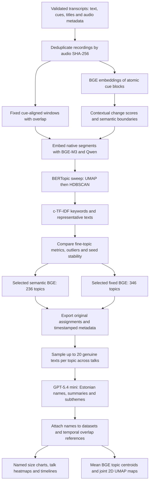

# Arvamusfestival transcript archive

This project builds a durable JSON transcript archive for the 2026 Arvamusfestival
podcast season. It resolves the podcast collection through the [Apple Podcasts
lookup API](https://itunes.apple.com/lookup) (collection ID `1477431807`) and then
uses the authoritative SoundCloud RSS feed returned by Apple. The RSS enclosure is
the audio source; its publication date determines the archive year.

## Prerequisites

Use Windows PowerShell with [uv](https://docs.astral.sh/uv/) installed and on
`PATH`. Install `ffmpeg` and make it available on `PATH`, because the external
Estonian audio-transcription skill processes MP3 audio. Configure the local skill
script path exactly as shown below, or replace it with the matching path on your
machine.

```powershell
uv sync --dev
uv run arvamusfestivali-transcripts run --year 2026 --dry-run --transcriber-script C:\Users\risto\projects\skils_plugins\plugins\estonian-audio-transcription\skills\estonian-audio-transcription\scripts\transcribe.py
uv run arvamusfestivali-transcripts run --year 2026 --limit 1 --transcriber-script C:\Users\risto\projects\skils_plugins\plugins\estonian-audio-transcription\skills\estonian-audio-transcription\scripts\transcribe.py
uv run arvamusfestivali-transcripts run --year 2026 --transcriber-script C:\Users\risto\projects\skils_plugins\plugins\estonian-audio-transcription\skills\estonian-audio-transcription\scripts\transcribe.py
```

The first command is a dry run: it discovers the selected episodes but does not
write state, cache, or archives. The second is the one-episode acceptance run. Use
the third only after inspecting that archive. Pass `--uv-executable` when the
transcription skill must use a uv executable outside `PATH`.

## Operations

`run` downloads an episode, invokes the local transcriber, validates its output, and
writes `data/transcripts/<year>/<soundcloud-id>.json`. It resumes safely: existing
valid archives are skipped unless `--force` is supplied. Process several episodes
concurrently with `--parallelism`; each worker uses the transcriber's default four
CPU threads, so `--parallelism 4` is appropriate for a 16-vCPU machine:

```powershell
uv run arvamusfestivali-transcripts run --year 2026 --parallelism 4 --catalog-snapshot data/catalog/<timestamp>-2026.json --transcriber-script C:\Users\risto\projects\skils_plugins\plugins\estonian-audio-transcription\skills\estonian-audio-transcription\scripts\transcribe.py
```

The default remains `--parallelism 1`. Each worker uses an independent HTTP client,
state-database connection, and engine-output directory. Retry an episode after fixing
its cause with the same command plus `--episode-id`:

```powershell
uv run arvamusfestivali-transcripts run --year 2026 --episode-id 2400217815 --transcriber-script C:\Users\risto\projects\skils_plugins\plugins\estonian-audio-transcription\skills\estonian-audio-transcription\scripts\transcribe.py
```

`fetch` only builds the verified audio cache; `transcribe` only consumes verified
cached audio and a saved catalog. All commands support `--root`, `--limit`,
`--episode-id`, `--parallelism`, `--force`, and `--dry-run` as applicable. Year values
are accepted from 2019 through the current UTC year.

For a reproducible run, pass `--catalog-snapshot data/catalog/<timestamp>-2026.json`.
For `run`, this frozen snapshot must match `--year`; it prevents Apple and RSS
requests. The snapshot’s sibling XML is the raw source record. To add a later year,
run the same command with that year after its festival feed has published episodes;
the first regular run writes its matching catalog snapshot automatically.

## Archive format and links

Each transcript is UTF-8 JSON with `schema_version: 1`, `episode`, and
`transcription` objects. Episode data retains the SoundCloud ID, RSS GUID, title,
publication timestamp, Apple collection ID, page/audio URLs, audio byte count and
SHA-256. Transcription data retains engine `model` and `runtime` metadata, complete
text, and timestamped cues (`start_seconds`, `end_seconds`, `text`). There is no
speaker diarization: cue timestamps identify time, not a speaker.

Construct a link to a cue with the W3C media fragment form
`<episode.audio_url>#t=<cue.start_seconds>`; for example,
`https://example.invalid/episode.mp3#t=754.2`.

Audio cache files are deleted only after a validated transcript archive is written.
On download, transcription, or archive failure, the verified cache remains for a
safe retry. Temporary partial downloads use `.part` files.

## Git policy

Commit the catalog snapshots in `data/catalog/` and final transcript JSON in
`data/transcripts/`. Do not commit `data/audio-cache/`, `data/engine-output/`, or
`data/state/`; these resumability and engine artifacts are intentionally ignored,
along with `*.part` download files.

## Development

```powershell
uv run pytest -q
uv run ruff check .
uv build
```

## Compare transcript embedding models

The [comparison notebook](notebooks/compare_embedding_models.ipynb) compares
Qwen3-Embedding-0.6B and BGE-M3 embeddings as inputs to BERTopic. Gemini is optional.
It uses validated archives in `data/transcripts/2026/`, deduplicates recordings by
audio SHA-256, and deterministically chooses six recordings with varied titles. Each
model receives the same timestamped passages and BERTopic settings.

Install the analysis dependencies and open the notebook from the repository root:

```powershell
uv sync --group dev --group topic-analysis
uv run --group topic-analysis jupyter lab notebooks/compare_embedding_models.ipynb
```

To compare the original fixed passages with local semantic boundaries, open the
[segmentation notebook](notebooks/compare_segmentation_modes.ipynb):

```powershell
uv run --group topic-analysis jupyter lab notebooks/compare_segmentation_modes.ipynb
```

If this checkout uses the repository-visible Windows environment created under
`data/state`, launch it with:

```powershell
$uv = "$PWD\data\state\uv-tool\bin\uv.exe"
$env:UV_PROJECT_ENVIRONMENT = "$PWD\data\state\af-topic-env"
& $uv run --group topic-analysis jupyter lab notebooks/compare_segmentation_modes.ipynb
```

The segmentation notebook retains both modes. BGE-M3 embeds non-overlapping,
cue-aligned atomic blocks and detects contextual similarity drops; the resulting
semantic passages and the fixed passages are each compared with Qwen and BGE under
controlled BERTopic settings. Atomic BGE vectors are cached separately, so boundary
threshold experiments reuse them. Segmentation is entirely local and never invokes
Gemini. Inspect the boundary-score chart on a small sample before increasing
`EPISODE_COUNT` or switching `DEVICE` to `"cuda"`.

Run the cells in order. The configuration cell exposes `YEAR`, `EPISODE_COUNT`,
`EXPLICIT_EPISODE_IDS`, `MODEL_KEYS`, `DEVICE`, `BATCH_SIZES`, `CHUNKING`, and
`TOPIC_MODEL`. To choose recordings yourself, set canonical IDs such as
`EXPLICIT_EPISODE_IDS = ("2400207762", "2400207759")`; this replaces automatic
selection. The IDs must exist in the chosen year after deduplication. You can also
omit a model from `MODEL_KEYS` to run fewer adapters. The defaults run local models on
the CPU with batch size four; expect the first run to download model weights and take
substantial time and several gigabytes of disk and memory. Use a smaller batch size
if memory is tight. A compatible GPU can be selected with `DEVICE = "cuda"`.

Gemini is skipped cleanly when `GEMINI_API_KEY` is absent. To enable it for the
current PowerShell session, enter the key without printing it:

```powershell
$env:GEMINI_API_KEY = Read-Host -MaskInput "Gemini API key"
```

Enabling Gemini sends the selected passage text to Google's API and may incur API
usage charges. Check that the transcripts are appropriate to send before setting the
key. A failed model reports a remediation hint while successful model results remain
available. Per-passage embedding files are saved under
`data/topic-analysis/cache/`; repeat runs reuse matching cached vectors. Each run
exports a manifest, passage and assignment tables, metrics, cross-model comparison,
and a manual-review CSV under `data/topic-analysis/results/<experiment-id>/`.
In the notebook's manual-review cell, add `ManualTopicReview` records to
`MANUAL_REVIEWS` with a `coherent`, `mixed`, `duplicate`, or `unclear` verdict and a
note. Rerun that cell and the export cell to preserve completed annotations.
Probability exports include the explicit topic-column mapping; HDBSCAN memberships
are not calibrated semantic confidence. Outliers have no assigned-topic probability.
Both generated directories are ignored by Git. Keep the exported manifest with any
results you share: it records model identities, configurations, audio hashes, and the
Git revision.

Local model defaults pin immutable Hugging Face snapshot commits (Qwen
`97b0c614be4d77ee51c0cef4e5f07c00f9eb65b3`, BGE
`5617a9f61b028005a4858fdac845db406aefb181`). The manifest saves full cache configuration,
including revisions, instruction, dimensions, and adapter schema. Schema 2 invalidates
older vectors because both cache keys and inference now use NFC text with collapsed
whitespace; original transcript text remains available for inspection.

The metric table is descriptive. Silhouette uses Euclidean distance on the actual
UMAP coordinates supplied to HDBSCAN, separately from the two-dimensional display
projection. It excludes outliers and may be unavailable
with fewer than two non-outlier topics; topic count and outlier fraction can change
with clustering settings. Separate UMAP maps are **not geometrically aligned**, so
compare assignments and source passages rather than plot coordinates. Use the
timestamped audio links in the representative, disputed, and low-membership boundary
tables. Disputes compare which passages are clustered together, independent of topic
numbering; two noise points are not a shared cluster. Then fill
the notebook's manual review annotations before judging coherence.

## Current detailed topic workflow

The current analysis covers **219 deduplicated talks**. Topics are discovered from
segment text using embeddings and clustering; an LLM subsequently names the discovered
topics. Naming changes labels, not segment boundaries or cluster assignments.



Both selected models use `leaf-local-6-2`, seed `42`: UMAP with 10 neighbors,
5 components, cosine metric and minimum distance 0; HDBSCAN with minimum cluster size
6, minimum samples 2, Euclidean metric and leaf selection. BERTopic uses multilingual
text handling, preserved Estonian accents, unigram/bigram keywords and BM25-weighted
c-TF-IDF with frequent-word reduction. No automatic topic merging is enabled.
The notebook compares 32 configurations: two segmentations, two embedding models,
four clustering candidates and two seeds. Its snapshot default is still `leaf-6-2`;
set `SELECTED_CANDIDATE = "leaf-local-6-2"` when repeating the selected-model snapshot.

| Selected model | Native segments | Assigned topics | Unassigned segments |
| --- | ---: | ---: | ---: |
| Semantic BGE | 4,132 | 236 | about 20% |
| Fixed BGE | 6,545 | 346 | about 24% |

The 582 topics are **two overlapping model vocabularies**, not 582 distinct subjects.
Topic IDs are scoped to a fitted model; use `topic_key` across models and `segment_key`
across segmentations. Topic `-1` means unassigned content. The reusable dataset has
10,677 rows with original text, talk titles, timestamps, audio links and membership
strengths. `other_model_overlaps` links the other model's native segments by time;
these are not independent predictions on the same segment boundaries.

The naming run used `gpt-5.4-mini-2026-03-17` with structured outputs and `store=False`.
It retained 7,513 full-text examples, taking up to 20 unique segments per topic,
covering different talks and including weaker members. The 223 topics with fewer
than ten members use all available members. Original keyword labels remain available.
The model returned `high` naming confidence and `coherent` for every topic; these
self-assessments are not validated quality measures. Segment `confidence` remains
HDBSCAN membership strength, not a calibrated probability of semantic correctness.

The embedding maps use normalized means of original 1,024-dimensional BGE segment
vectors, projected together into 2D. Dot **area** tracks assigned segment count;
hover shows the topic name and ID. The joint projection supports comparing the two
maps, while 2D distances remain approximate. Coverage heatmaps union intervals within
a topic to avoid counting overlapping fixed windows twice; coverage across different
topics can still sum above 100%.

Current saved outputs:

- [Segment dataset](data/topic-analysis/results/segment-dataset/README.md): combined Parquet,
  with separate Parquet, CSV and JSONL exports also available in the analysis workspace.
- [Topic naming evidence](data/topic-analysis/results/topic-names/topic-review.html):
  searchable names, keywords, summaries and full timestamped examples.
- [Named charts](data/topic-analysis/results/named-topic-charts/index.html): both models'
  topic sizes, talk/topic heatmaps and timelines with recording selectors.
- [Topic embedding maps](data/topic-analysis/results/topic-maps/index.html): separate maps
  for the 236 semantic and 346 fixed topics, using the new names.
- [Experiment tables](data/topic-analysis/results/fine-topics/): topic tables, talk profiles
  and manifests for all 32 configurations. Full assignment CSVs are local run outputs.

Jev classification and broader multi-label categories are proposed next steps; they
have **not** been run. The current assignments come from BERTopic/HDBSCAN.

## Inspect segments and assigned topics

Open [review_segment_topics.ipynb](notebooks/review_segment_topics.ipynb) to review
saved assignments without fitting models or making API calls:

```bash
uv run --group topic-analysis jupyter lab notebooks/review_segment_topics.ipynb
```

Run its cells, select a document by zero-based index or title, and choose Both,
Semantic or Fixed. Both compares the same recording side by side with each model's
native segments. Cards show full text, Estonian topic names and IDs, timestamps,
audio links, membership strength and original keyword labels. Timeline colors make
subject changes and unassigned content visible. Filters include unassigned segments,
weak memberships and text/topic-name search. Document indices are sorted by title;
use the episode ID when referring to a document across changing datasets.

The notebook defaults to `data/topic-analysis/results/segment-dataset/all-segments.parquet`.
Set `TOPIC_REVIEW_DATASET` to inspect another dataset. A direct-selection cell is also
provided for viewers without interactive widgets.

## Repeat the topic analysis

The repository includes the reusable
[`arvamusfestival-topic-analysis` skill](skills/arvamusfestival-topic-analysis/SKILL.md).
Its references cover the modelling configuration and the ordered export/naming steps,
including restarting on a new corpus without accidentally reusing old topic IDs.
A discoverable copy is installed in this workspace's Codex skills directory.

Example request: “Use `$arvamusfestival-topic-analysis` to repeat this topic workflow
for the updated transcripts, keeping both segmentations and saving a separate run.”
On another machine, copy `skills/arvamusfestival-topic-analysis/` to your Codex
skills directory, then start a new session. Follow the skill's
[modelling guide](skills/arvamusfestival-topic-analysis/references/modelling.md) for fitting
and its [export guide](skills/arvamusfestival-topic-analysis/references/exports.md) for
reusable datasets, evidence-grounded names and offline charts. Existing chart exports
can be regenerated without fitting or additional LLM calls.
